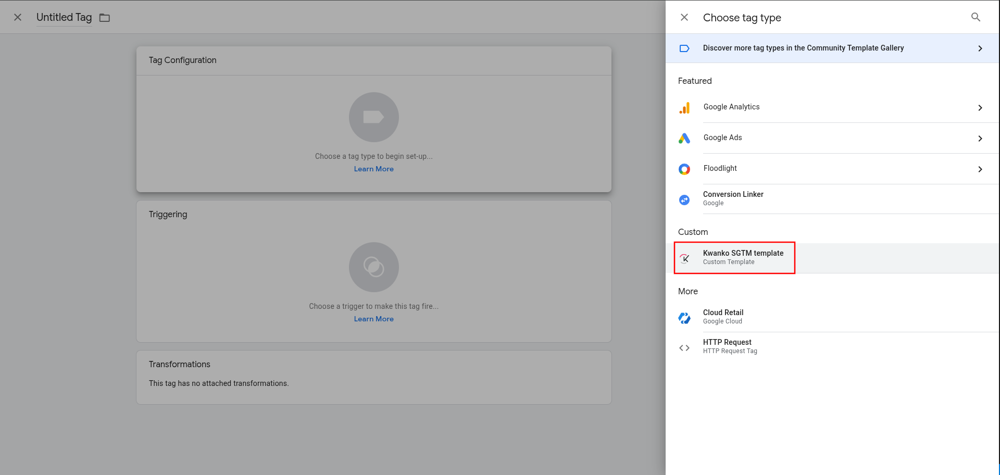

# Kwanko SGTM template setup guide

In this documentation, you'll find the detailed steps to easily import and setup the Kwanko tracking template for [Google Server-side Tag Manager](https://developers.google.com/tag-platform/tag-manager/server-side?hl=en).

## Introduction

### What is it for ?

This template helps you to implement the Kwanko tracking solution through SGTM containers.
It helps storing and sending the Kwanko click identifier in your SGTM container for conversion tracking.

### When should I install it ?

This tag might be usefull if you want to setup our tracking solution through an SGTM container without installing/using our custom javascript tracking library (uniJS) on your website.

### What does it do ?

This tag has 2 main functionnalities based on `event_name` parameter provided through event data:

* in **page_view** context: it will watch over incoming Kwanko **kwkuniv** param added by Kwanko in click links redirected to your website. \
This parameter is automatically parsed from current page from `page_location` event data. \
The value of this param will then be stored in a cookie called **kwku** on SGTM container level and used later when the `purchase` event is fired.
So this tag should be setup and triggered on all your website pages on page view to ensure optimal tracking.
* in **purchase** context: it will fetch the latest Kwanko tracking identifier from the **kwku** cookie stored in the container and then send a Kwanko conversion tracking through the sandboxed `sendHttpRequest()` method.

## Using the template

### Prerequisites

In order to use the Kwanko SGTM tracking template, you'll first have to setup and test your server container (cf https://developers.google.com/tag-platform/learn/sst-fundamentals/4-sst-setup-container)

### 1. Import template

Template can be installed:

* from the template gallery:

* downloaded manually from the [Kwanko github repository](https://github.com/kwanko/sgtm-tag) and imported in the template section:

### 2. Create a tag using the template

Create a tag using the imported Kwanko template:

### 3. Tag template configuration

Once created, the tag needs to be configured:

Below is an overview of the complete list of parameters.

| Field    | Description | Kwanko parameter equivalence |
| -------- | ------- | ------- |
| Conversion tracking identifier (default - old client)  | (string) default conversion tracking identifier OR old client specific identifier if applies |`mclic` |
| First party tracking host | (string) First party tracking host if applies (without "https://" and trailing slash) | - |
| Conversion tracking identifier (alternative - new client) | (string) alternative conversion tracking identifier for new client if applies | `mclic` |
| Transaction id | (string) transaction id | `argann` |
| Transaction amount | (float) transaction amount | `argmon` |
| Custom currency ISO code | (string) ISO 4217 code | `nacur` |
| Voucher code | (string) voucher code | `argbr` |
| Payment method | (string) payment method name | `argmode` |
| New client flag | (int) new client flag 0 <=> no, 1 <=> yes | - |
| GDPR context | (int) GDPR context flag if applies 0 <=> no, 1 <=> yes | `gdpr` |
| TCF v2 consent string | (string) IAB TCF v2 consent string | `gdpr_consent` |

It is possible to setup additionnal custom parameters based on a free parameter name and value.

### Tests

It is important to test the communication with your Server-side container through the preview mode in order to check the correct implementation.
